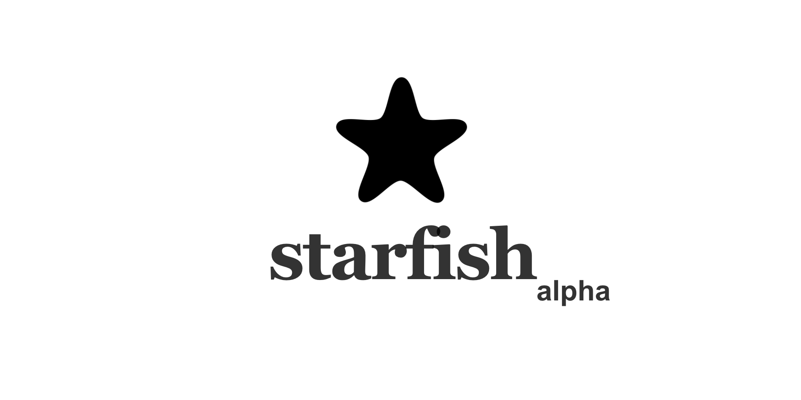

# tokenpass-server

> A Peer to Peer Identity System, powered by Bitcoin based on Starfish.

- Official Website: https://tokenpass.network
- Original Starfish Server Video Explanation: https://www.youtube.com/watch?v=fglt2jkVpQA



# Introduction

- **tokenpass-server** is an implementation of the Starfish identity scheme, which takes the form of a node.js web server.
- **[tokenpass-desktop](https://github.com/rohenaz/tokenpass-desktop)**, a cross platform desktop app implementation (Mac, Windows, Linux) is powered by **tokenpass-server**. The desktop app wraps the tokenpass-server in an app format.

# How tokenpass-server works


tokenpass-server is an implementation of the Starfish scheme that takes the form of a node.js module that runs as a web server at port `21000`.

The web server receives POST requests at its `/sign` endpoint and signs the request message with its embedded wallet and returns the HTTP response.

As of v0.1.0, the response format looks like this:

```
{
  "address": <The Signer Bitcoin Address>,
  "sig": <The Signature>,
  "message": <The message that was requested and signed>,
  "ts": <The unix timestamp at which the signature was made>
}
```

# Using the node module

Install the module in your project:

```
npm install --save tokenpass-server
```

And then start the server:

```
import * as tokenpass from 'tokenpass-server'
tokenpass({
  db: <The Key Path for TokenPass>
})
```

It will start a `/sign` endpoint at port `21000`.

If you make a POST request with a "message" attribute, it will sign the message and return the response.

```
<html>
<script>
fetch("http://localhost:21000/sign", {
  method: 'post',
  headers: { "Content-Type": "application/json" },
  body: JSON.stringify({
    message: "Sign this message!"
  })
}).then((res) => {
  return res.json()
}).then((res) => {
  console.log("Respons", res)
})
</script>
</html>
```

# Running as standalone

If you want to run tokenpass-server as a standalone app instead of a node module, you should first checkout the TokenPass app, which wraps the `tokenpass-server` module in a cross platform app format that supports Mac, Windows, and Linux.

But if you must directly run `tokenpass-server` without running it as an app format, you can also do that. Just do:

```
npm install -g tokenpass-server
```

to install globally, and then run

```
tokenpass
```

# Updates since starfish-server

- Sign endpoint accepts optional encoding to support signing binary data such as sigma messagehash buffers.

# Authenticaten Scopes

```
  "read_profile",
  "write_profile",
  "read_state",
  "write_state",
  "fund",
  "encrypt",
  "decrypt",
  "transfer",
```
